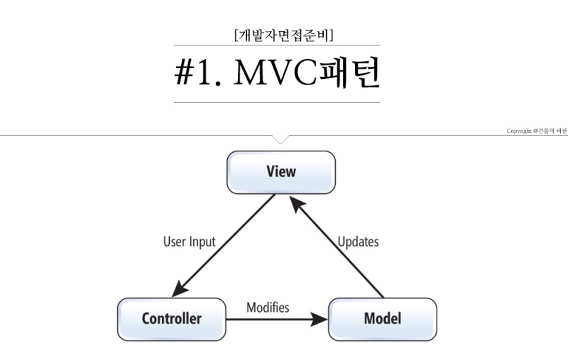

# MVC Pattern 

MVC 패턴은 위와 같은 구조로 형성 되어 있다. 

## MVC pattern 이란

- MVC 패턴은 디자인 패턴 중 하나이다. 
- 어플리케이션 혹은 프로젝트를 구성 할 때 Model, View, Controller 세 단계로 나누어 구성 한다. 
- 세개의 계층으로 나눈 이유는 계층 간 dependency를 줄여주기 위함이다. (loose coupling)

### Controller

- 사용자의 요청을 수용하는 계층이다. 
- 요청을 수용하는 계층이라 함은 예를 들어 restAPI를 통해 들어온 요청에 대한 method에 따라 약속 된 행위에 해당하는 method를 call 해주는 계층이다. 
- 좀 더 구체적인 예시를 들자면 post method의 요청이 들어왔을 때 controller 단에서 바로 db에 create을 수행하는 것이 아닌 db 관련 로직이 수행되는 layer, 즉 계층의 method를 call만 해주는 것이다. 
- Controller는 View 와 Model에 대한 정보를 알고 있어야한다. 
- 이는 사용자에 의한 이벤트를 처리하여 각 계층에 전달해주는 인터페이스 역할을 하기 때문이다. 

### Model 

- 어플리케이션의 정보, 데이터를 나타내는 계층이다. 
- Entity Class에 해당하는 계층이다. 
- 주로 DB에 관한 작업이 수행 되는 계층이다. 
- 대개 최하위 계층이며 가장 core 한 계층이라 볼 수 있다. (Business logic은 model을 토대로 구축 되기 때문에 다른 계층에 의하여 쉽사리 변경되면 안되기 때문이다.)

### View 

- 사용자에게 수행된 작업에 대한 결과를 보여주는 계층이다. 
- View는 model의 정보를 저장하고 있으면 안된다. 
- View 또한 model과 동일하게 다른 계층에 대해 알면 안된다. 

## 개인적인 생각 

- MVC 패턴은 여러 디자인 패턴 중 기본이 되는 패턴 같다. 
- Clean architecture에서도 MVC의 근본이 되는 개념을 모두 이용하고 있다. 
- 이는 모두 작업이 분리된 독립적 계층들을 구축하여 서로 간의 의존성을 줄여주고자 나온 디자인 패턴이다. 
- 어느 디자인 패턴이 옳다라는 정답은 없고 각 비즈니스 로직에 따라 가장 적합하며 독립성을 유지할 수 있는 디자인 패턴을 채택하면 될꺼 같다라는 개인적인 생각이다. 

